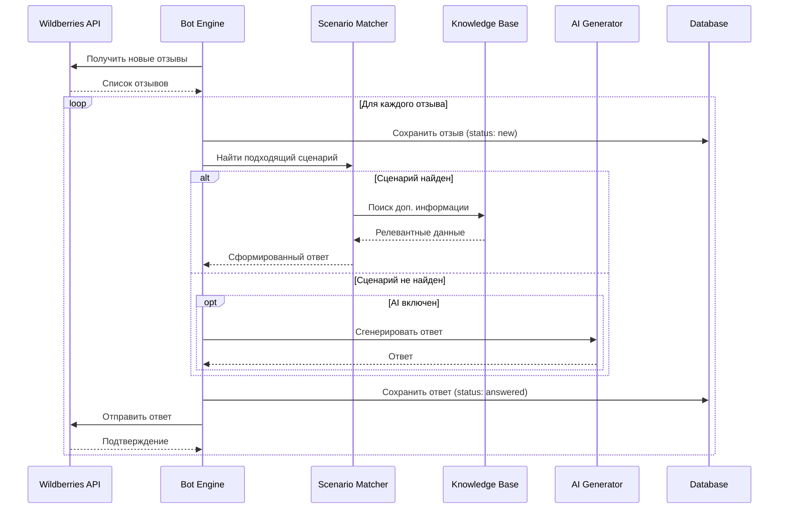

# Архитектура бота для ответов на отзывы Wildberries

## 📋 Обзор проекта

Бот для автоматизации ответов на отзывы в личном кабинете Wildberries с веб-интерфейсом управления.

### Ключевые требования
- Ответы по заранее прописанным сценариям
- Подключение собственной базы знаний
- Самый доступный способ реализации
- Код разбит на блоки с номерами
- Комментарии на русском языке
- Веб-интерфейс управления

---

## 🏗️ Архитектура системы

```mermaid
flowchart TB
    subgraph UI[Веб-интерфейс Next.js]
        A[Дашборд]
        B[Управление сценариями]
        C[Просмотр отзывов]
        D[Настройки API]
    end

    subgraph API[API Routes]
        E[/api/reviews]
        F[/api/scenarios]
        G[/api/settings]
        H[/api/knowledge-base]
    end

    subgraph Core[Ядро бота]
        I[WB API Client]
        J[Engine сценариев]
        K[Генератор ответов]
    end

    subgraph Data[Хранилище данных]
        L[(SQLite/JSON)]
        M[База знаний]
    end

    subgraph External[Внешние сервисы]
        N[Wildberries API]
        O[LLM API опционально]
    end

    A --> E
    B --> F
    C --> E
    D --> G
    
    E --> I
    F --> J
    G --> L
    H --> M
    
    I --> N
    J --> K
    K --> O
    K --> M
```

---

## 📁 Структура проекта

```
src/
├── app/                          # Next.js App Router
│   ├── page.tsx                  # Главная страница - дашборд
│   ├── layout.tsx                # Корневой layout
│   ├── globals.css               # Глобальные стили
│   │
│   ├── reviews/                  # Страница отзывов
│   │   └── page.tsx
│   │
│   ├── scenarios/                # Управление сценариями
│   │   └── page.tsx
│   │
│   ├── knowledge-base/           # База знаний
│   │   └── page.tsx
│   │
│   ├── settings/                 # Настройки
│   │   └── page.tsx
│   │
│   └── api/                      # API Routes
│       ├── reviews/
│       │   └── route.ts          # CRUD отзывов
│       ├── scenarios/
│       │   └── route.ts          # CRUD сценариев
│       ├── knowledge-base/
│       │   └── route.ts          # CRUD базы знаний
│       ├── settings/
│       │   └── route.ts          # Настройки API
│       └── bot/
│           ├── start/route.ts    # Запуск бота
│           ├── stop/route.ts     # Остановка бота
│           └── status/route.ts   # Статус бота
│
├── components/                   # React компоненты
│   ├── ui/                       # Базовые UI компоненты
│   │   ├── Button.tsx
│   │   ├── Card.tsx
│   │   ├── Input.tsx
│   │   ├── Modal.tsx
│   │   └── Table.tsx
│   │
│   ├── layout/                   # Компоненты layout
│   │   ├── Header.tsx
│   │   ├── Sidebar.tsx
│   │   └── Footer.tsx
│   │
│   └── features/                 # Функциональные компоненты
│       ├── ReviewCard.tsx
│       ├── ScenarioEditor.tsx
│       ├── KnowledgeBaseEditor.tsx
│       └── BotStatus.tsx
│
├── lib/                          # Библиотеки и утилиты
│   ├── wb-api/                   # Блок 1: API Wildberries
│   │   ├── client.ts             # Клиент API
│   │   ├── types.ts              # Типы данных
│   │   └── endpoints.ts          # Эндпоинты
│   │
│   ├── bot/                      # Блок 2: Ядро бота
│   │   ├── engine.ts             # Движок обработки
│   │   ├── scheduler.ts          # Планировщик задач
│   │   └── processor.ts          # Обработчик отзывов
│   │
│   ├── scenarios/                # Блок 3: Система сценариев
│   │   ├── matcher.ts            # Сопоставление шаблонов
│   │   ├── templates.ts          # Шаблоны ответов
│   │   └── variables.ts          # Переменные подстановки
│   │
│   ├── knowledge-base/           # Блок 4: База знаний
│   │   ├── loader.ts             # Загрузчик базы
│   │   ├── searcher.ts           # Поиск по базе
│   │   └── updater.ts            # Обновление базы
│   │
│   ├── ai/                       # Блок 5: AI генерация (опционально)
│   │   ├── generator.ts          # Генератор ответов
│   │   └── prompts.ts            # Промпты для LLM
│   │
│   └── db/                       # Блок 6: База данных
│       ├── schema.ts             # Схема Drizzle
│       ├── index.ts              # Экспорт
│       └── migrations/           # Миграции
│
├── data/                         # JSON файлы данных
│   ├── scenarios.json            # Сценарии ответов
│   ├── knowledge-base.json       # База знаний
│   └── settings.json             # Настройки
│
└── types/                        # TypeScript типы
    ├── review.ts                 # Типы отзывов
    ├── scenario.ts               # Типы сценариев
    ├── knowledge.ts              # Типы базы знаний
    └── api.ts                    # Типы API
```

---

## 🔧 Блоки кода с описанием

### Блок 1: API Wildberries
**Файлы:** `src/lib/wb-api/*`

**Назначение:** Взаимодействие с API личного кабинета Wildberries

**Функции:**
- Авторизация по API ключу
- Получение списка отзывов
- Отправка ответов на отзывы
- Обработка ошибок API

### Блок 2: Ядро бота
**Файлы:** `src/lib/bot/*`

**Назначение:** Основная логика работы бота

**Функции:**
- Периодический опрос новых отзывов
- Применение сценариев к отзывам
- Отправка сформированных ответов
- Логирование действий

### Блок 3: Система сценариев
**Файлы:** `src/lib/scenarios/*`

**Назначение:** Управление сценариями ответов

**Функции:**
- Сопоставление ключевых слов
- Выбор подходящего шаблона
- Подстановка переменных (имя товара, дата и т.д.)
- Приоритизация сценариев

### Блок 4: База знаний
**Файлы:** `src/lib/knowledge-base/*`

**Назначение:** Хранение и поиск информации

**Функции:**
- Загрузка базы знаний из JSON/БД
- Поиск релевантной информации
- Обновление базы через UI

### Блок 5: AI генерация (опционально)
**Файлы:** `src/lib/ai/*`

**Назначение:** Генерация ответов с помощью LLM

**Функции:**
- Интеграция с OpenAI API
- Формирование промптов
- Обработка ответов AI

### Блок 6: База данных
**Файлы:** `src/lib/db/*`

**Назначение:** Хранение данных приложения

**Функции:**
- Схема данных (Drizzle ORM)
- Миграции
- CRUD операции

---

## 📊 Модель данных

### Сценарий ответа
```typescript
interface Scenario {
  id: string;
  name: string;
  priority: number;
  isActive: boolean;
  
  // Условия срабатывания
  conditions: {
    keywords: string[];        // Ключевые слова
    rating?: number[];         // Фильтр по оценке
    hasText?: boolean;         // Есть ли текст отзыва
    productIds?: string[];     // Конкретные товары
  };
  
  // Шаблон ответа
  template: {
    text: string;              // Текст с переменными
    variables: string[];       // Список переменных
  };
  
  createdAt: Date;
  updatedAt: Date;
}
```

### Отзыв
```typescript
interface Review {
  id: string;
  wbId: string;                // ID в Wildberries
  productId: string;
  productName: string;
  rating: number;
  text: string;
  author: string;
  createdAt: Date;
  
  // Статус обработки
  status: 'new' | 'processing' | 'answered' | 'error';
  answer?: string;
  answeredAt?: Date;
  error?: string;
}
```

### База знаний
```typescript
interface KnowledgeItem {
  id: string;
  category: string;
  question: string;
  answer: string;
  keywords: string[];
  tags: string[];
}
```

---

## 🔄 Поток обработки отзыва



---

## 🎨 Веб-интерфейс

### Страницы

1. **Дашборд** (`/`)
   - Статус бота (работает/остановлен)
   - Количество новых отзывов
   - Статистика за период
   - Последние ответы

2. **Отзывы** (`/reviews`)
   - Таблица отзывов с фильтрами
   - Просмотр деталей отзыва
   - Ручная корректировка ответа
   - Отправка/отклонение

3. **Сценарии** (`/scenarios`)
   - Список сценариев
   - Редактор сценариев
   - Приоритизация
   - Тестирование

4. **База знаний** (`/knowledge-base`)
   - Категории знаний
   - CRUD записей
   - Поиск
   - Импорт/экспорт

5. **Настройки** (`/settings`)
   - API ключ Wildberries
   - Интервал опроса
   - Настройки AI
   - Авторизация

---

## 🛠️ Технологический стек

| Компонент | Технология |
|-----------|------------|
| Фреймворк | Next.js 16 |
| UI | React 19 + Tailwind CSS 4 |
| Язык | TypeScript 5.9 |
| База данных | SQLite + Drizzle ORM |
| HTTP клиент | fetch (native) |
| AI (опционально) | OpenAI API |
| Менеджер пакетов | Bun |

---

## ✅ Уточнённые требования

На основе ответов пользователя:

1. **База знаний:** JSON файлы с веб-редактором для сотрудников без программирования
   - Полная информация о товарах компании
   - Условия работы и гарантии
   - Простой веб-интерфейс для редактирования

2. **API Wildberries:** Будет получен после готовности бота
   - Реализовать клиент с заглушкой для тестирования
   - Настраиваемый API ключ через веб-интерфейс

3. **Логика ответов:** Комбинированный подход (C)
   - Шаблоны с ключевыми словами для типовых случаев
   - AI-генерация для сложных/нестандартных отзывов

4. **Веб-интерфейс:**
   - Просмотр отзывов и ответов
   - Редактирование сценариев и шаблонов
   - Редактор базы знаний

5. **Авторизация:** Без авторизации (A)
   - Только локальный доступ

---

*Требования уточнены 2026-02-22*
